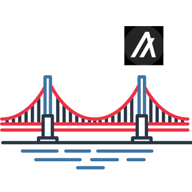

<p align="center"></p>
<h2 align="center">AlgoBridge</h2>


### Architecture

AlgoBridge is an oracle based bridge between algorand and avalanche. 

Three main architectures are:
- AlgoBridge-Avax: It contains bridge and liquidity contracts in solidity as well as the oracle interactions.
- AlgoBridge-Algorand: It contains PyTeal liquidity and bridge contracts for oracle interactions.
- Oracle solution: This script keeps in sync between the two chains to release the corresponding tokens.

### Tech Stack

Smart Contracts
- Python
- Solidity

Frontend
- React.js
- RandLabs MyAlgo
- Web3

Backend (Oracle Bot)
- Express
- AlgoSDK

### How to set up?

Client Set Up

```bash
# git clone
cd client
docker build -t back .
docker run -p 5000:80
```

Setting up oracle

```bash
# git clone
cd oracle
npm i
node oracle.js
```


<p align="center"> Made with ❤️ and 💻</p>
